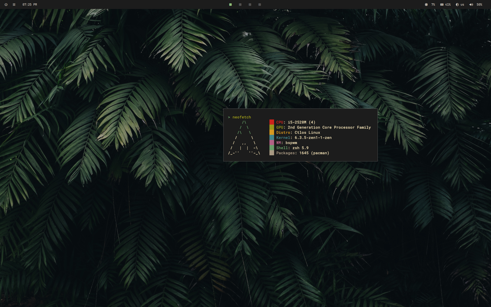
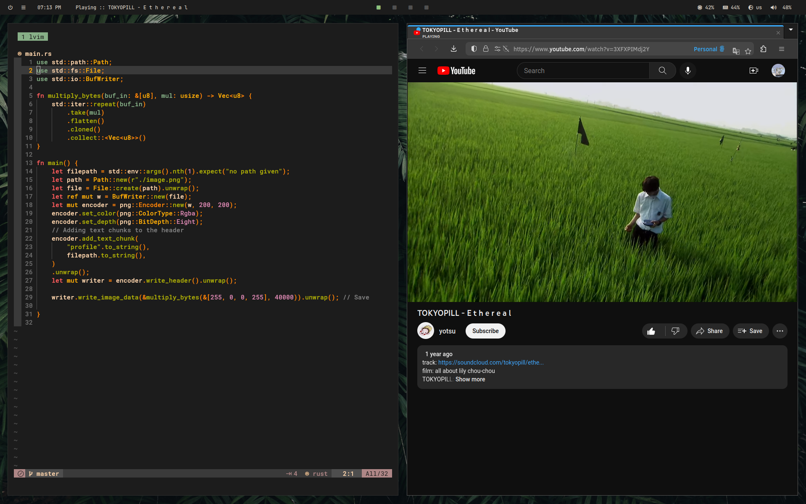

# .dotfiles
.dotfiles that give me inner peace, you're free to clone them and edit them as you wish. There are no fancy animations in picom. Only smooth fading with delta=3

## Dependencies
I use [ctlos](https://ctlos.github.io/) as distro, which is based on Arch Linux. 

- bspwm
- sxhkd
- rofi 
- tmux
- kitty
- zsh
  - oh-my-zsh
- picom
- polybar
- playerctl

Other "dependencies" are executables from scripts. Feel free to modify or delete them from .dots
